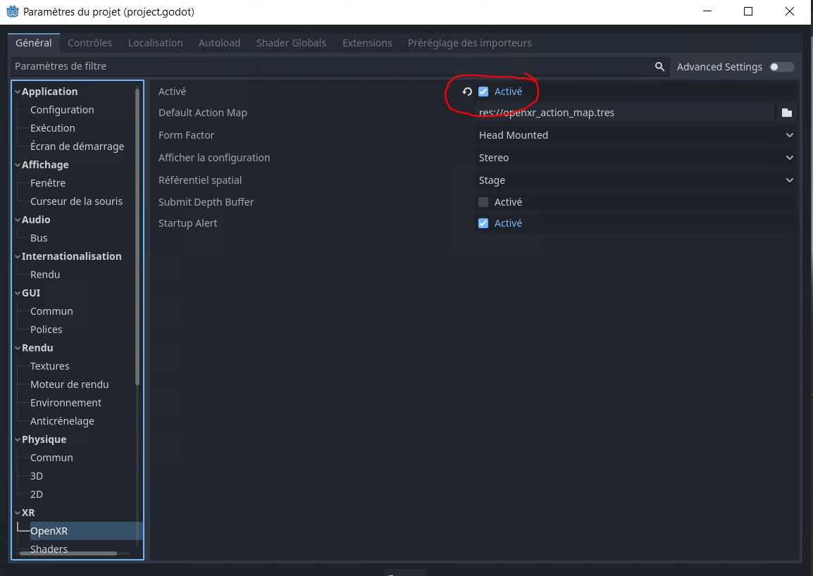
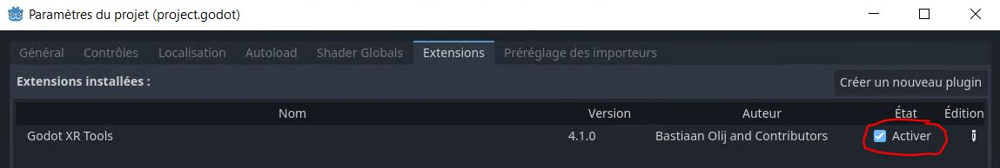
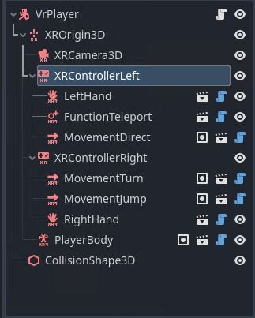
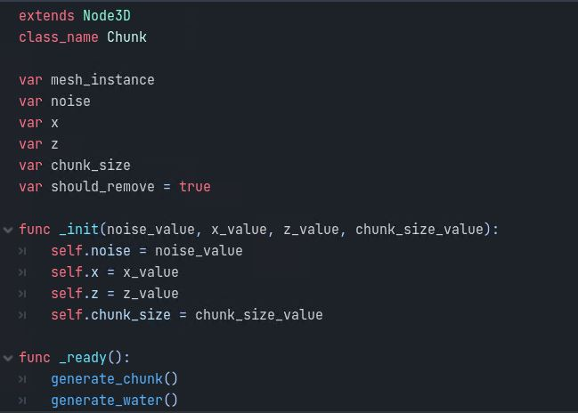
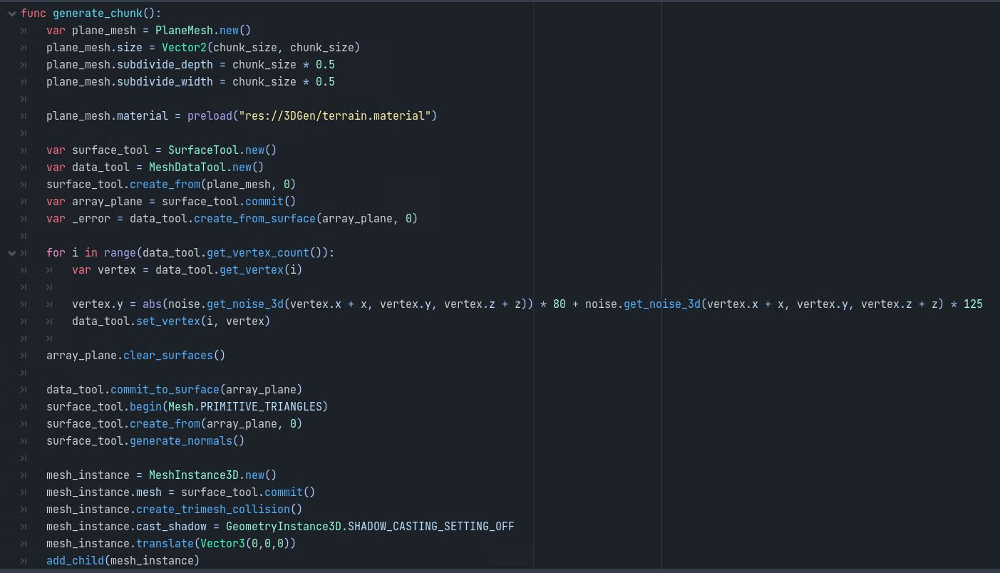
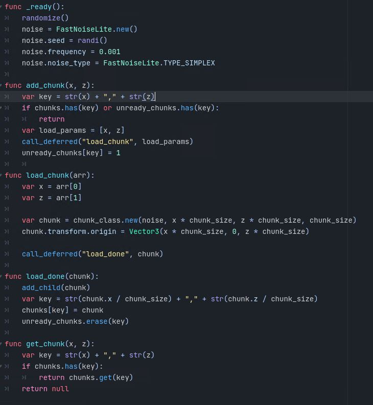
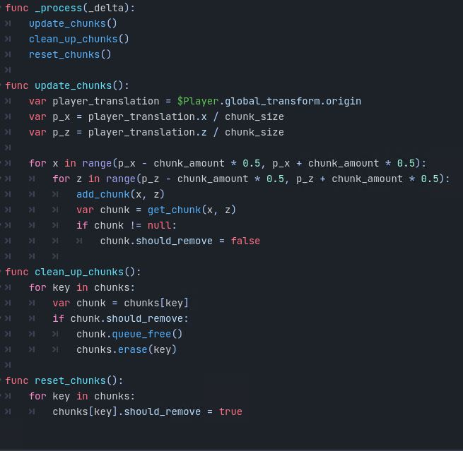

 

**Samuel Cossette**

  

**Rapport**

  

**Travail présenté à**

**Nicolas Bourré**

  

**Cégep de Shawinigan**

**31 mai 2023**

---

 

# Table des matières

- [Introduction](#introduction)
- [Explication Projet](#explication-projet)
- [Explication Fonctionnalité](#explication-fonctionnalité)
- [Conclusion](#conclusion)
- [Référence / Médiagraphie](#référence--médiagraphie)

 

# Introduction

Depuis la révolution technologique du 20ème siècle, d’innombrables nouvelles activités ont lentement émergé dans la société. Ces activités, principalement des loisirs, sont devenues des portes d'entrée vers le monde professionnel. Les jeux vidéo en sont un exemple. Les jeux vidéo n'ont pas toujours été populaires depuis leur invention. En effet, leur popularité a augmenté grâce aux jeux classiques et simplistes d'arcade tels que Pac-Man ou encore Galaga. Depuis leur importante évolution, l'industrie a apporté de nombreux progrès, permettant la création de jeux tels que Mario Kart, Zelda, CSGO, Valorant, Minecraft, etc. Avec la continuation de cette envolée technologique, les dix dernières années ont contribué à développer une nouvelle technologie : la réalité virtuelle. La réalité virtuelle est un environnement stimulant qui offre à l'utilisateur une expérience 3D immersive. Un autre aspect clé de l'évolution des jeux vidéo est l'intégration de la génération procédurale. La génération procédurale est une technique qui permet de créer des mondes, des niveaux et des contenus de manière aléatoire et automatique, en utilisant des algorithmes et des règles préétablies. Cette approche offre une expérience de jeu unique à chaque session, rendant les jeux plus dynamiques et augmentant leur rejouabilité. Aujourd'hui, la réalité virtuelle et la génération procédurale sont utilisées dans de nombreuses industries, notamment dans les jeux vidéo, la formation professionnelle, l'immobilier, la médecine et même dans l'industrie du tourisme. Les jeux vidéo sont probablement les applications les plus populaires de la réalité virtuelle et de la génération procédurale, offrant des expériences immersives et uniques. Cependant, il existe également des applications sérieuses qui permettent aux professionnels de s'entraîner dans des environnements virtuels sans risque, d'explorer des sites immobiliers ou de visualiser des procédures médicales complexes. Bien que la réalité virtuelle et la génération procédurale soient encore relativement nouvelles et en constante évolution, elles offrent un potentiel incroyable pour améliorer la façon dont nous interagissons avec le monde numérique et peut-être même avec le monde réel.

 

# Explication Projet

Mon projet consiste à développer un jeu vidéo dans Godot 4.0 qui utilise la génération procédurale et la réalité virtuelle (VR). Ainsi, mon projet combine ces deux aspects pour offrir une expérience de jeu unique et immersive. La génération procédurale garantit que chaque partie du jeu est différente. La réalité virtuelle ajoute une couche d'immersion supplémentaire en permettant aux joueurs de vivre le jeu de manière plus réaliste et interactive. En résumé, mon projet consiste à développer un jeu vidéo qui utilise la génération procédurale pour créer du contenu de manière algorithmique, et qui exploite la réalité virtuelle pour offrir aux joueurs une expérience immersive et interactive.

 

# Explication Fonctionnalité

## Réalité Virtuel :

Tout d'abord, dans les settings (Général/XR/OpenXR), doit être activé.

Par la suite, l'installation des addons pour avoir des outils rapide d'utilisation. Une fois installé, activé l'extension dans les settings du projet (Extensions/nom)

Finalement, une fois ces deux étapes de faite, il ne reste plus qu'à créer notre joueur. En partant d'un CharacterBody3D, nous ajoutons le point d'origine de notre personnage (XROrigin3D). Par la suite, nous ajoutons à ce noeud deux XrController et une XRCamera3D. La dernière partie sert à ajouter les scripts de l'extension que nous avons ajouté

## Génération procédurale :

Le premier script est une classe appelée "Chunk" qui étend la classe Node3D. Il crée des morceaux de terrain en utilisant un bruit généré par la variable "noise". Le terrain est généré sous forme de maillage en utilisant un objet PlaneMesh. Les sommets du maillage sont modifiés en fonction du bruit généré, ce qui crée des variations de hauteur. Le maillage est ensuite utilisé pour créer une instance de MeshInstance3D, qui est ajoutée comme enfant de la scène. De plus, le script génère également de l'eau en utilisant un autre objet PlaneMesh et l'ajoute également comme enfant de la scène.

Le deuxième script étend la classe Node3D et gère la génération dynamique de morceaux de terrain (chunks). Il utilise un bruit généré par l'objet FastNoiseLite pour générer les variations de terrain. Les chunks sont créés en fonction de la position du joueur et sont ajoutés à la scène lorsque nécessaire. Les chunks qui ne sont plus nécessaires sont supprimés pour optimiser les performances. Le script maintient une liste des chunks générés et utilise des dictionnaires pour gérer leur ajout, suppression et réinitialisation.

 

# Résultats

Lors du développement, j'ai obtenu une carte qui se génère automatiquement avec du bruit, et j'ai pu tester l'utilisation de la réalité virtuelle pour mon joueur. Je ne m'attendais pas à faire une carte avec la génération procédurale et je suis stupéfait par le résultat de celle-ci. L'effort que j'ai mis dans ce projet est celui qui était attendu selon moi, car j'ai passé beaucoup d'heures à essayer de comprendre comment fonctionne la génération procédurale pour ensuite l'implémenter.

# Conclusion

En conclusion, la génération procédurale et la réalité virtuelle offrent un vaste potentiel dans le domaine des jeux vidéo. La génération procédurale permet de créer des mondes uniques et infinis, offrant ainsi une expérience de jeu renouvelée à chaque partie. De plus, la réalité virtuelle offre une immersion sans précédent, permettant aux joueurs de s'immerger totalement dans des univers virtuels. Ces deux technologies combinées ouvrent de nouvelles perspectives passionnantes pour l'industrie du jeu vidéo, offrant des expériences plus immersives, créatives et dynamiques aux joueurs du monde entier.

 

# Référence / Médiagraphie

[Godot](https://en.wikipedia.org/wiki/Godot_(game_engine)#Godot_4)

[Godot documentation](https://docs.godotengine.org/en/stable/)

[Génération procédurale](https://fr.wikipedia.org/wiki/G%C3%A9n%C3%A9ration_proc%C3%A9durale)

[Vidéo Godot 4.0 sur génération procédurale](https://www.youtube.com/watch?v=rcsIMlet7Fw)

[Godot XR documentation](https://docs.godotengine.org/en/latest/tutorials/xr/setting_up_xr.html)

[Outil background](https://skybox.blockadelabs.com/)

[FastNoiseLite documentation](https://docs.godotengine.org/en/stable/classes/class_fastnoiselite.html)

[Blender CheatSheet](https://www.makeuseof.com/tag/blender-keyboard-shortcuts-cheat-sheet-windows/)
